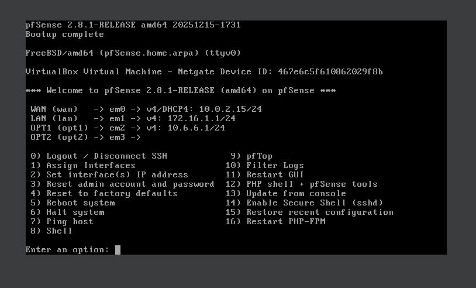

# Phase 1: Infrastructure Setup & Network Design

This phase covers building the actual foundation of the lab—getting the virtual wires hooked up, configuring the firewall containment, and standing up the Active Directory domain so everything can talk safely without leaking traffic onto my home network.

---

## 🏗️ VirtualBox Network Setup
To isolate the lab while keeping full control over how traffic moves, I set up four separate network adapters inside the pfSense firewall VM:

* **Adapter 1 (WAN):** Set to **NAT Network** (`NatNetwork`). This gives pfSense a path out to the internet for software patches, but completely blocks the VMs from natively scanning or interacting with my host computer's local home subnet.
* **Adapter 2 (LAN):** Set to Internal Network **`Windows`** (`172.16.1.0/24`). This is the target corporate network where the Windows machines live.
* **Adapter 3 (OPT1):** Set to Internal Network **`Kali`** (`10.6.6.0/24`). This keeps the attack platform completely separated from the targets.
* **Adapter 4 (OPT2):** Set to Internal Network **`Mirror`** with Promiscuous Mode set to **Allow All**. This acts as a network tap that I pre-configured to feed raw packet traffic into Security Onion later on.

---

## 📊 How the Lab is Deployed

### 1. Firewall Routing & Network Safety (pfSense)
* **Network Segmentation:** Separated the `Windows` network from the `Kali` network so nothing moves between them unmonitored. 
* **Inter-VLAN Traffic:** There is a default rule on the OPT1 interface that handles the routing between subnets, allowing the Kali box (`10.6.6.10`) to ping and scan straight across into the Windows network (`172.16.1.0/24`) so attacks can land.
* **Home Network Protection:** To make sure my hacking tools or potential malware cannot leak out of the lab, I created a firewall alias that groups all standard home network IP ranges (`10.0.0.0`, `172.16.0.0`, and `192.168.0.0`) under the name `Private_IP_Ranges`.
* **The Block Rule:** I placed a strict **Block** rule at the very top of both the LAN and OPT1 interfaces targeting that alias. Because firewalls read rules from the top down, pfSense will instantly drop any traffic trying to reach a home network address, keeping my personal household devices completely safe and isolated.

### 2. Active Directory (`DC01`)
* Built a Windows Server 2022 VM and gave it a static IP of `172.16.1.10`.
* Installed Active Directory Domain Services (AD DS) and created a brand new root domain named **`lab.local`**.
* Opened up Active Directory Users and Computers (ADUC) and manually created a couple of test accounts to mimic a real company network: a standard employee user named `Bob Smith` and a domain administrator account named `John Admin`.

### 3. Workstation (`Win11Vic`)
* Provisioned a clean Windows 11 workstation that pulls a DHCP address (`172.16.1.100`) from the firewall.
* Fixed its network settings to point its DNS requests straight to the Domain Controller (`172.16.1.10`).
* Successfully joined the machine to the **`lab.local`** domain, verifying that it registers as a managed asset under the controller.

* ---

## 📷 Phase 1 Lab Verification Screenshots

### VirtualBox Network Setup & Interface Configuration

### Perimeter Security & Network Safety Containment

